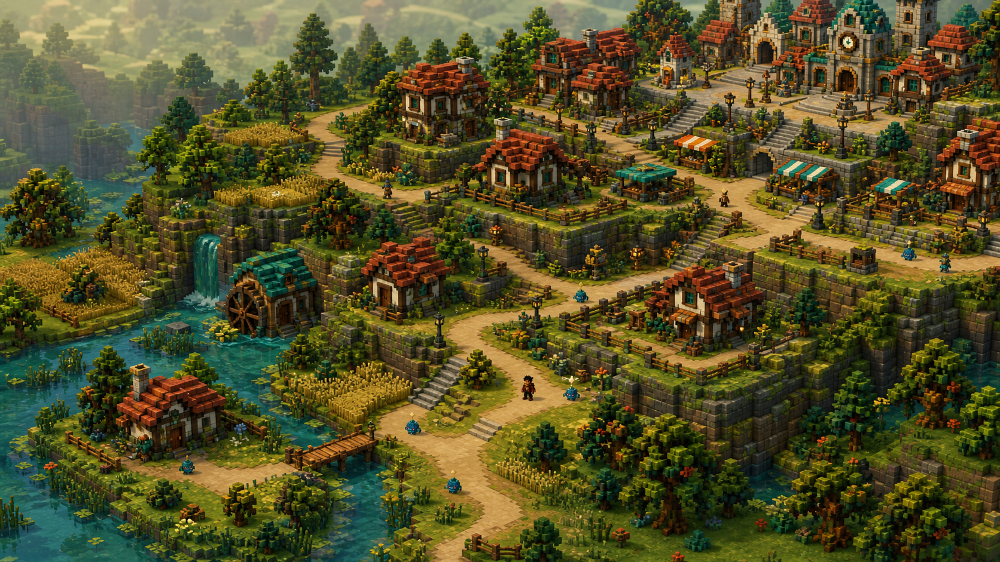
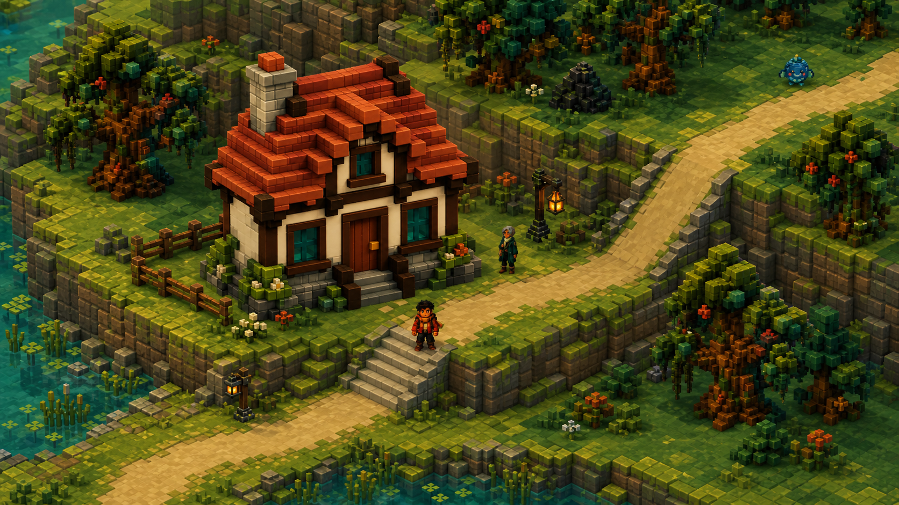
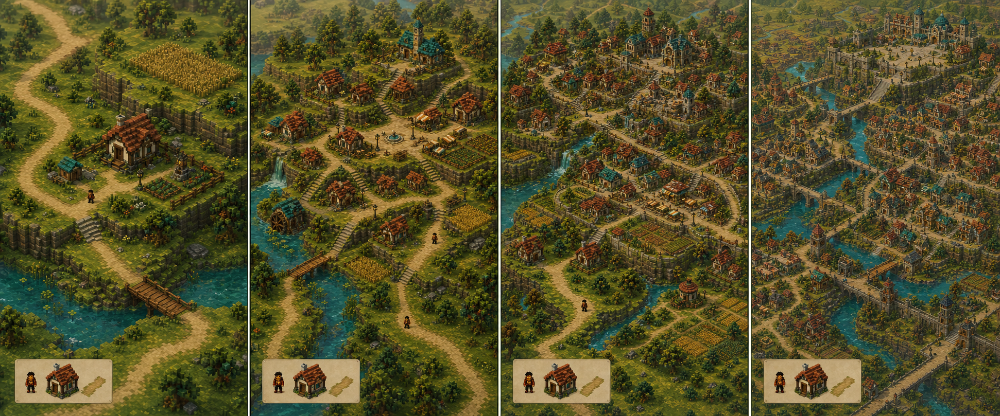

# Terrain and world-scale redesign decision brief

> Status: proposal awaiting game-designer approval.
>
> Working assumption: the shipped overworld is authored and persistent. Procedural
> generation is primarily an editor-time world-building tool; runtime generation is
> reserved for explicitly procedural locations such as a future dungeon.

## Why this redesign is needed

The live starter area is a `2200 x 1300` world drawn as one continuous flat surface.
At the current human-relative scale, that is only about `15.5 x 9.2` human heights,
so it can frame a lodge, a trail, and a small preserve but cannot establish the
street, parcel, district, and landmark hierarchy needed for a village, town, or
city.

The rejected `features/terrain_elevation/` prototype proved one useful principle:
gameplay can remain in canonical 2D ground coordinates while height changes the
faux-2.5D presentation. It was rejected for good reasons, however. A few hard-coded
polygons and visual offsets do not provide reusable terrain data, cliff traversal,
stairs, hills, biome rules, chunk streaming, navigation topology, or scalable
authoring.

The two concept images below are composition and terrain-grammar targets, not
literal runtime rendering requirements. The shipped game should retain the live
build's calmer surfaces and stronger character readability.

### Macro settlement and terrain scale

This view tests how rural parcels can grow into village, town, and civic density
without flattening the world into one large background.

### Gameplay elevation and traversal scale

This closer view validates the minimum terrain grammar at normal exploration
scale: three elevation bands, an obvious wide stair, a continuous road and ramp,
a cliff that blocks travel away from those links, grounded actors and architecture,
and a small biome transition. Runtime terrain should reduce the concept's per-block
noise while preserving these broad silhouettes and traversal cues.

## What to borrow from the terrain references

- Borrow non-destructive generation graphs, masks, stamps, and tiled outputs from
  World Machine, Instant Terra, World Creator, and TerraForge3D.
- Borrow the artist-first sequence of base terrain, biome population, streaming,
  and manual refinement from Gaia.
- Borrow the idea of hand-painted control masks and explicit flat/structured zones
  from the NVIDIA terrain chapter. Roads, plazas, building parcels, stairs, and
  landmarks must be stronger constraints than noise.
- Treat erosion as an offline authoring filter that can suggest drainage, worn
  edges, and moisture. Do not simulate hydraulic erosion during normal gameplay.
- Keep the useful data products—height/elevation, flow, moisture, biome weights,
  surface coverage, and scatter masks—but quantize and simplify them for the
  project's crisp voxel language.

## Three viable approaches

| Approach | Shape | Strengths | Costs / risks |
|---|---|---|---|
| A. Layered TileMap terrain | Discrete elevation and terrain types authored directly in `TileMapLayer` layers | Most native to Godot 2D; predictable collision and terrain painting; easy isolated scenes | Organic contours and ramps require a large tile vocabulary; hand-authoring a region can become repetitive |
| B. Continuous heightfield renderer | A sampled height grid produces polygons, contours, cliff faces, collision, and biome shading | Organic hills and erosion-derived shapes; close to the linked terrain tools | A large custom rendering/editor stack; harder navigation, crisp voxel art, stairs, and authored settlements; repeats the rejected prototype at a larger scale if topology is not explicit |
| **C. Compiled hybrid terrain graph — recommended** | A chunked discrete elevation grid plus biome masks, authored stamps, and explicit traversal links compiles into native 2D render/collision/navigation chunks | Keeps the locked 2D direction; supports broad hills, terraces, stairs, ramps, roads, districts, deterministic generation, hand-authored overrides, and streaming | Requires an editor-time compiler and a small terrain-data model before adding content |

## Recommendation

Choose **C: compiled hybrid terrain graph**.

The authoritative terrain is data, not a background texture and not the rendered
polygons. Each chunk stores a coarse, deterministic field with:

- discrete elevation levels;
- surface and biome weights;
- water and cliff boundaries;
- explicit ramp, stair, bridge, gate, and cave-link traversal;
- authored road, parcel, landmark, and protected-area stamps;
- deterministic scatter candidates for vegetation, rocks, and ambient details.

An editor-time compiler turns that data into presentation layers, cliff faces,
collision edges, navigation regions/links, and scatter placements. Runtime code
loads compiled chunks and samples terrain; it does not rerun erosion or rebuild the
whole world.

This creates one source of truth for both appearance and walkability. A height
difference with no traversal link is a cliff. A stair or ramp is an explicit link
that both the player and navigation understand. The visual projection can remain
faux-2.5D without pretending cliffs are merely sprite offsets.

## Procedural versus authored responsibility

Use procedural systems to make a strong first draft:

1. Seeded low-frequency noise proposes macro elevation and moisture.
2. A simplified flow/erosion pass proposes waterways and worn valleys.
3. Biome rules combine elevation, moisture, slope, and authored regional identity.
4. A settlement graph proposes road hierarchy and buildable zones.
5. Authored stamps override the proposal for roads, plazas, parcels, stairs,
   landmark foundations, encounter spaces, gates, and quest-critical sightlines.
6. Validation rejects disconnected paths, unreachable parcels, invalid cliff
   transitions, and missing entrances before chunks are baked.

The generator should never be the game designer. It may scatter trees; it may not
decide where the Trailkeeper Lodge, a badge challenge, or a city's main gate must
exist.

## Settlement scale ladder

Treat the current starter map as approximately one **neighborhood-sized terrain
chunk**, not an entire village.

| Scale | Suggested composition | Streaming/content implication |
|---|---|---|
| Homestead / route stop | One landmark parcel, 1–3 minor structures, one encounter or interaction loop | One partial chunk or authored stamp |
| Village | 8–20 buildings around a commons, trail junction, water source, and one strong landmark | Roughly `2 x 2` neighborhood chunks; several screens of travel |
| Town | 30–80 buildings, market street, service/civic core, residential edges, and 2–4 named neighborhoods | Roughly `4 x 3` chunks; stream the local neighborhood plus neighbors |
| City | Multiple named districts with their own landmarks, gates, transit links, and biome/terrain relationship | Do not keep the whole city live; compose several town-scale districts and stream or transition between them |

### Settlement scale progression

The panels read from left to right as route stop, village, town, and city. The
repeated scale key in the lower-left corner of every panel keeps one player, one
standard lodge, and one road segment at the same reference size. The camera
extent grows; the world objects do not shrink to make the settlement fit.

The final panel is a world-planning composition, not a runtime loading promise.
Its waterways, bridges, civic terrace, market fabric, residential terraces, and
agricultural edge are separate district responsibilities. At runtime, only the
active district and a small neighbor ring should own full simulation, collision,
navigation, interaction, and high-detail rendering.

Density should rise toward the settlement core while terrain remains legible:
rural parcels have broad yards; villages cluster around a commons; towns align
facades to streets and plazas; cities reuse a kit of row buildings, courtyards,
walls, stairs, bridges, and civic landmarks rather than drawing hundreds of unique
houses at once.

## Boundaries for the next design section

The detailed design should preserve these non-goals:

- no switch to a 3D controller or free camera;
- no infinite runtime world;
- no runtime hydraulic erosion;
- no fully procedural quest-critical settlements;
- no single always-loaded city scene;
- no independent render, collision, and navigation height definitions;
- no mutation of `content/*.tres` definitions during play.

If the recommended approach is approved, the next section will define the scene
tree, Resource schemas, ownership map, signal map, projection/sorting contract,
chunk lifecycle, and the smallest isolated vertical slice.

## Image-generation record

The concept was generated with the built-in image-generation tool. Reference
roles were: the live game capture for camera/palette/scale, `lodge.png` for
construction language, and `terrain_cliff_face_v2.png` for a restrained cliff
material cue. The generation requested a wide orthographic voxel environment with
four elevation bands, biome transitions, roads, stairs, ramps, bridges, and a
rural-to-civic settlement-density gradient; it prohibited UI, text, proprietary
franchise content, photorealism, and a switch to a realistic 3D open-world style.
The exact final prompt is preserved in
`docs/godot-prompter/specs/terrain-world-redesign-image-prompt.md`.
The gameplay-scale prompt is preserved in
`docs/godot-prompter/specs/terrain-gameplay-elevation-image-prompt.md`.
The settlement progression prompt is preserved in
`docs/godot-prompter/specs/terrain-settlement-scale-image-prompt.md`.

## Research links

- https://www.world-machine.com/
- https://www.wysilab.com/
- https://github.com/Jaysmito101/TerraForge3D
- https://www.world-creator.com/en/index.phtml
- https://developer.nvidia.com/gpugems/gpugems3/part-i-geometry/chapter-1-generating-complex-procedural-terrains-using-gpu
- https://www.procedural-worlds.com/products/professional/gaia-pro/
- https://huw-man.github.io/Interactive-Erosion-Simulator-on-GPU/
- https://github.com/csaddison/Hydraulic-Erosion-Sim
- https://lanlou123.github.io/Webgl-Erosion/
- https://www.udemy.com/course/procedural-terrain-generation-with-unity/
